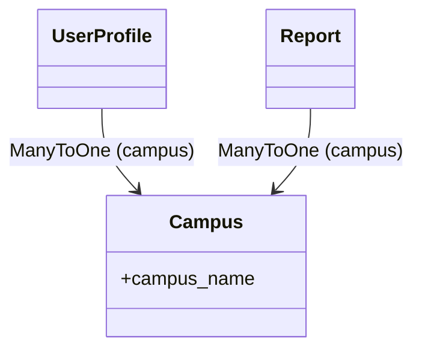
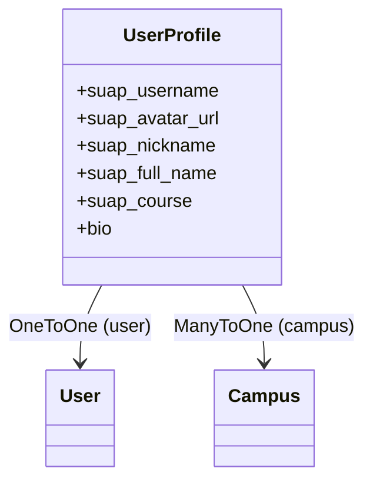
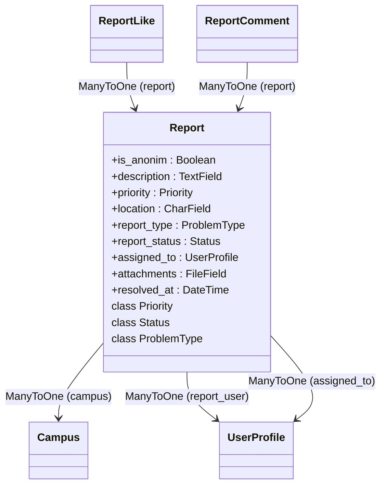
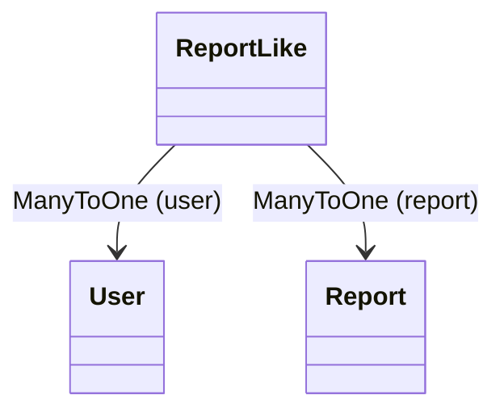
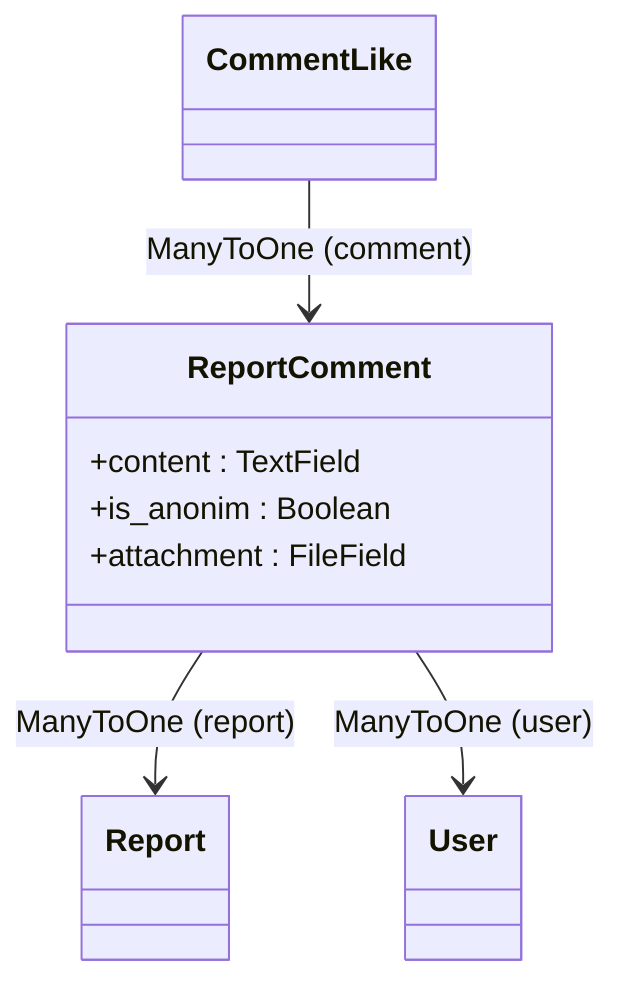
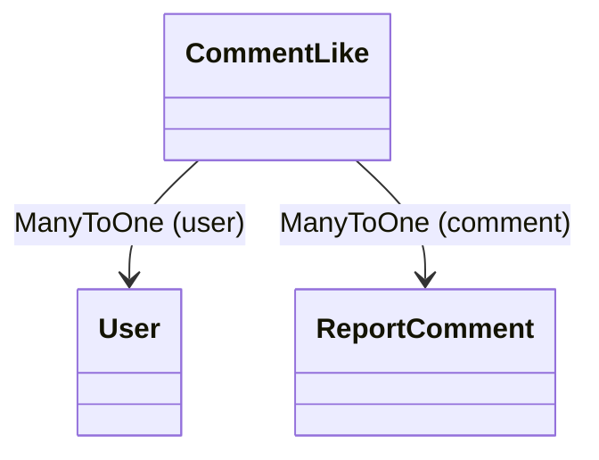

## Estrutura de Models

### Campus

- `campus_name` - Nome do campus (`CharField`)
#### Relações

### UserProfile

- `user` - Referência ao `User` do Django (`OneToOneField`)
- `campus` - Referência ao campus do IFPI (`ForeignKey` para `Campus`)
- `suap_username` - Nome de usuário único fornecido pelo SUAP (`CharField`)
- `suap_avatar_url` - URL do avatar do usuário no SUAP (`URLField`)
- `suap_nickname` - Apelido ou nome social (`CharField`)
- `suap_full_name` - Nome completo do usuário (`CharField`)
- `suap_course` - Curso ao qual o usuário está vinculado (`CharField`)
- `bio` - Descrição livre do perfil (`TextField`)
#### Relações

### Report

- `campus` – Referência ao campus do IFPI (`ForeignKey` para `Campus`).
- `report_user` – Usuário que criou o relatório (`ForeignKey` para `UserProfile`).
- `is_anonim` – Define se o relatório foi enviado anonimamente (`BooleanField`).
- `description` – Descrição detalhada do problema (`TextField`).
- `priority` – Nível de prioridade do problema (`CharField` usando `Report.Priority.choices`).
- `location` – Localização do problema dentro do campus (`CharField`).
- `report_type` – Tipo de problema (`CharField` usando `Report.ProblemType.choices`).
- `report_status` – Estado atual do chamado (`CharField` usando `Report.Status.choices`).
- `assigned_to` – Usuário designado para resolver o problema (`ForeignKey` para `UserProfile`, opcional).
- `attachments` – Arquivo opcional anexado ao relatório (`FileField`).
- `resolved_at` – Data e hora de resolução do chamado (`DateTimeField`, opcional).

#### Choices
- `Priority` - Define as prioridades possíveis do relatório (baixa, média, alta).
- `ProblemType` - Define os tipos de problema (hardware, software, rede, etc).
- `Status` - Define os estados do relatório (aberto, em andamento, resolvido ou fechado).
#### Relações

### ReportLike

- `user` - Usuário que curtiu o relatório (`ForeignKey` para `User`)
- `report` - Relatório que recebeu a curtida (`ForeignKey` para `Report`)
#### Relações

### ReportComment

- `report` - Relatório comentado (`ForeignKey` para `Report`)
- `user` - Usuário que fez o comentário (`ForeignKey` para `User`)
- `content` - Texto do comentário (`TextField`)
- `is_anonim` - Indica se o comentário foi feito anonimamente (`BooleanField`)
- `attachment` - Arquivo opcional anexado ao comentário (`FileField`)
#### Relações

### CommentLike

- `user` - Usuário que curtiu o comentário (`ForeignKey` para `User`)
- `comment` - Comentário que recebeu a curtida (`ForeignKey` para `ReportComment`)
#### Relações

